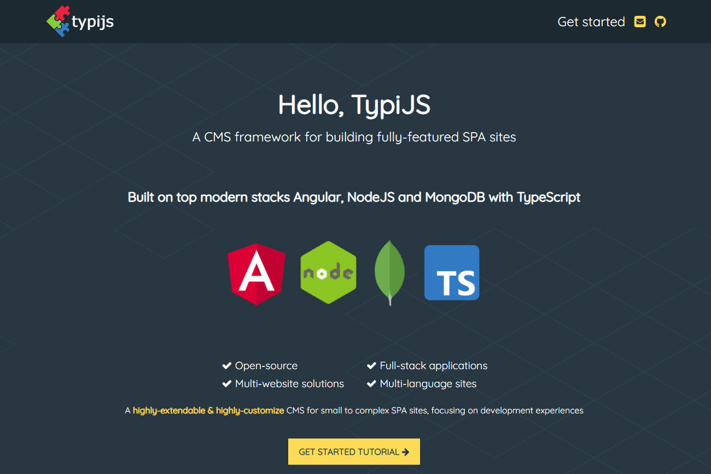

<!-- PROJECT LOGO -->
<br />
<p align="center">
  <a href="https://www.typijs.com">
    
  </a>

  <h3 align="center">TypiJS Website</h3>

  <p align="center">
    The project for building the official TypiJs website
    <br />
    <a href="https://www.typijs.com"><strong>Explore the site »</strong></a>
    <br />
    <br />
    <a href="https://github.com/typijs/typijs.github.io/issues">Report Bug</a>
    ·
    <a href="https://github.com/typijs/typijs.github.io/issues">Request Feature</a>
  </p>
</p>


<!-- ABOUT THE PROJECT -->
## About The Project

[](https://www.typijs.com)


### Built With

* [Jekyll](https://jekyllrb.com/)

<!-- GETTING STARTED -->
## Getting Started

To get a local copy up and running follow these simple steps.

### Prerequisites

For running this site on local, please following these steps.
* npm
  ```sh
  npm install npm@latest -g
  ```

* jekyll - See installation here https://jekyllrb.com/docs/installation/

### Installation

1. Clone the repo
   ```sh
   git clone https://github.com/typijs/typijs.github.io.git
   ```
2. Install `jekyll` and `bundler` 
    ```sh
        gem install jekyll bundler
    ```
### Development

```sh
    jekyll serve
```

<!-- LICENSE -->
## License

Distributed under the MIT License. See `LICENSE` for more information.


<!-- CONTACT -->
## Contact

Email: contact@typijs.com

Project Link: [https://github.com/typijs/typijs.github.io](https://github.com/typijs/typijs.github.io)


<!-- ACKNOWLEDGEMENTS -->
## Acknowledgements

* [Pudhina jekyll theme](https://github.com/knhash/Pudhina)
* [MongoDB live theme](https://www.mongodb.com/live)
